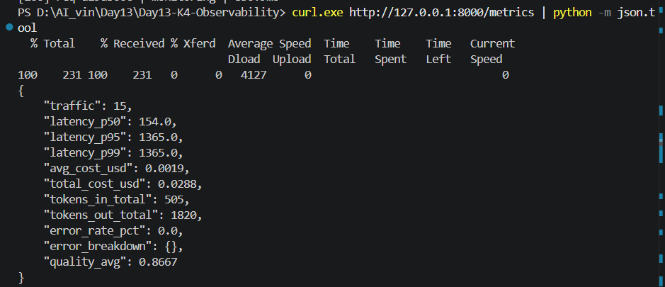
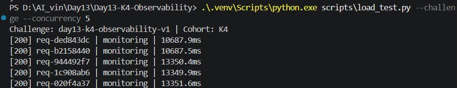
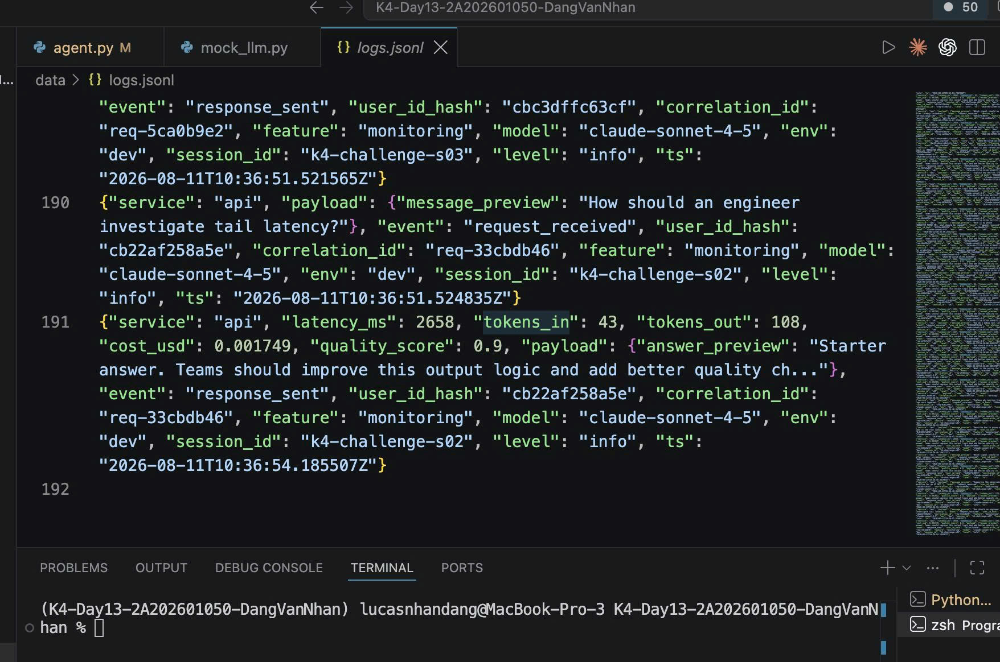

# Báo cáo Day 13 - AI Observability

## 1. Thông tin nhóm

- **Cohort:** K4
- **Challenge:** `day13-k4-observability-v1`
- **Repository:** <https://github.com/lucasnhandang/Day13-K4-Observability>
- **Commit SHA tại thời điểm hoàn thiện báo cáo:** `47f43bd`
- **Thành viên và vai trò:**
  - Đặng Văn Nhân (`2A202601050`) - API & Middleware.
  - Nguyễn Trần Gia Phụng (`2A202601286`) - Metrics & Dashboard.
  - Giáp Hoàng Thịnh (`2A202601492`) - Security/PII.
  - Trần Bá Lợi (`2A202601316`) - SRE, SLO, Alerts & Runbook.
  - Nguyễn Trương Ngọc Mai (`2A202601652`) - QA, Incident Investigation & Report.

## 2. Kết quả kỹ thuật

- **`python scripts/validate_logs.py`: 100/100.** Validator phân tích hơn 100 bản ghi hợp lệ; không còn bản ghi thiếu trường bắt buộc/enrichment, correlation ID propagation và PII scrubbing đều đạt, số PII leak là 0.
- **Tracing:** Langfuse hiển thị khoảng 300 observations; evidence có hơn 10 observations/traces trong một trang.
- **PII leak còn lại:** 0 theo validator. Email và số điện thoại Việt Nam được thay bằng `[REDACTED_EMAIL]` và `[REDACTED_PHONE_VN]` trước khi ghi log.
- **Dashboard contract:** `python scripts/validate_dashboard.py` trả về `HỢP LỆ: 6/6 panel có trong dashboard contract.`
- **Cấu hình dashboard:** [`config/dashboard.yaml`](../config/dashboard.yaml).
- **Kiểm thử tự động:** `python -m pytest -q` bằng virtual environment của dự án đạt **31 passed**, không còn cảnh báo deprecation và không xuất telemetry ra Langfuse trong quá trình test.

## 3. Logging và tracing

- **Correlation ID:** `req-ded843dc` xuất hiện xuyên suốt cặp log `request_received`/`response_sent` của session `k4-challenge-s02`; response có `latency_ms=2653`.
- **PII redaction:** [`data/logs.jsonl`](../data/logs.jsonl) chứa các message preview đã che email/số điện thoại; validator báo 0 PII leak.
- **Danh sách trace:** [`evidence/traces-list-10.png`](evidence/traces-list-10.png) cho thấy tối thiểu 10 observations và tổng xấp xỉ 300 observations trên Langfuse.
- **Trace waterfall:** [`evidence/trace-v1-production.png`](evidence/trace-v1-production.png) thể hiện cây `run` và metadata prompt; trace challenge cho thấy span `retrieve` chiếm khoảng 2,50 giây trong tổng 2,66 giây.
- **Span đáng chú ý:** `retrieve` là span chi phối latency. Phần `generate` chỉ khoảng 0,15 giây, vì vậy nút thắt nằm ở RAG retrieval, không nằm ở LLM generation.

## 4. Prompt versioning

- **Prompt name:** `day13-chat`.
- **Baseline:** version 1, label `baseline` (và được dùng làm `production` sau rollback).
- **Candidate:** version 2, label `candidate`.
- **Trace version 1:** `51f6cd9c8e350a38fe7ca4ef790c8a19` - [`evidence/trace-v1-production.png`](evidence/trace-v1-production.png).
- **Trace version 2:** `52a2245522d2dedb4a9a15c38935a14f` - [`evidence/trace-v2-candidate.png`](evidence/trace-v2-candidate.png).
- **Bằng chứng version/label:** ảnh trace v1 hiển thị `prompt_version=1`, `prompt_label=baseline`; ảnh trace v2 hiển thị `prompt_version=2`, `prompt_label=candidate`. [`evidence/run-v1-production.png`](evidence/run-v1-production.png) lưu bằng chứng lần chạy production/rollback về v1.

## 5. Dashboard, SLO và alerts

### 5.1. Kết quả dashboard

- Validator đạt **6/6 panel**: latency, traffic, errors, cost, tokens và quality.
- Time range/refresh theo contract: 60 phút/30 giây.
- Kết quả validator: [`evidence/dashboard-validator.png`](evidence/dashboard-validator.png).

### 5.2. Ba ảnh minh chứng

**Ảnh 1 - Baseline trước khi kích hoạt incident:** latency p95 ở trạng thái bình thường, làm mốc so sánh với challenge.

**Ảnh 2 - Chạy challenge với concurrency 5:** cả 5 request trả HTTP 200 nhưng độ trễ tăng rõ rệt khi `rag_slow` được bật.

**Ảnh 3 - Log theo correlation ID:** cặp bản ghi `request_received` và `response_sent` của `req-33cbdb46` xác nhận request thuộc feature `monitoring`
, session `k4-challenge-s02` và có `latency_ms=2658`.

### 5.3. SLO

- `latency_p95_ms <= 3000`, target 99,5%: chat là tương tác thời gian thực; vượt 3 giây làm trải nghiệm có cảm giác treo.
- `error_rate_pct <= 2`, target 99,0%: pipeline phụ thuộc RAG/tool ngoài nên cho phép lỗi thoáng qua nhỏ, nhưng trên 2% là ảnh hưởng người dùng rõ rệt.
- `daily_cost_usd <= 2.5`, target 100%: giới hạn ngân sách demo/lab và khớp threshold cost của dashboard.
- `quality_score_avg >= 0.75`, target 95%: ngưỡng tối thiểu để câu trả lời còn hữu ích.

### 5.4. Alert rules và runbook

- `high_latency_p95` (warning): p95 > 3000 ms trong 5 phút - [`docs/alerts.md#alert-1`](../docs/alerts.md#alert-1).
- `error_rate_high` (critical): error rate > 2% trong 5 phút - [`docs/alerts.md#alert-2`](../docs/alerts.md#alert-2).
- `daily_cost_budget` (warning): cost/phút > 2 lần baseline trong 10 phút - [`docs/alerts.md#alert-3`](../docs/alerts.md#alert-3).
- Cả ba rule đã được kiểm chứng bằng `scripts/inject_incident.py` và `scripts/load_test.py`; chi tiết tại [`evidence/alert_verification_loi.md`](evidence/alert_verification_loi.md).

## 6. Điều tra challenge

- **Challenge ID:** `day13-k4-observability-v1`.
- **Incident được release:** `rag_slow`; feature bị ảnh hưởng: `monitoring`.
- **Triệu chứng từ metrics/load test:** năm request đều HTTP 200 nhưng thời gian đầu-cuối tăng khoảng 10,66-13,33 giây khi chạy concurrency 5. Metrics phía server ghi nhận p95 khoảng 2.653 giây cho mỗi request ở lần đo lưu trong repo.
- **Trace liên quan:** `fd4451c5d2c3297eb986353ecc526fc5`, session `k4-challenge-s02`, correlation ID `req-33cbdb46`, latency 2,66 giây.
- **Log liên quan:** bản ghi `response_sent` của `req-33cbdb46` có `latency_ms=2658`, `feature=monitoring`, `model=claude-sonnet-4-5`, `quality_score=0.9`.
- **Luồng điều tra:** Metrics/load test phát hiện tail latency tăng -> mở trace theo session/correlation ID -> waterfall cho thấy `retrieve` ~2,50 giây và `generate` ~0,15 giây -> lọc JSON log theo cùng correlation ID để xác nhận server latency.
- **Root cause:** incident `rag_slow` cố ý đưa độ trễ vào bước RAG retrieval. Thời gian chờ tăng thêm khi nhiều request chạy đồng thời, nên độ trễ quan sát ở client cao hơn latency riêng lẻ trong trace.
- **Fix action:** tắt incident bằng `python scripts/inject_incident.py --disable`; sau đó chạy lại load test và kiểm tra p95 trở về baseline. Trong môi trường thật, cần timeout/circuit breaker cho retriever và fallback khi vector store chậm.
- **Preventive measure:** theo dõi p95/p99 theo feature, đặt alert `high_latency_p95`, ghi span riêng cho retrieval/generation, giữ correlation ID xuyên metrics-trace-log, và chạy regression load test sau thay đổi RAG/vector store.

## 7. Đóng góp cá nhân

| Thành viên | Phần việc | Commit/PR | Điều đã học |
|---|---|---|---|
| Đặng Văn Nhân | API, middleware, correlation ID và metadata request | `15e5a47`, PR #1 (`2bc0c8d`) | Correlation ID phải được bind đầu request, trả lại qua response header và đi xuyên suốt log/trace. |
| Giáp Hoàng Thịnh | PII scrubbing, thứ tự processor và kiểm chứng dữ liệu nhạy cảm | `cd07ad4`, PR #2 (`8f32ce6`) | PII phải được che trước JSON rendering; validator cần kiểm tra cả payload lồng nhau. |
| Nguyễn Trần Gia Phụng | Metrics, dashboard contract sáu panel và evidence | `a38a2c8`, PR #4 (`3abedf9`) | Dashboard chỉ hữu ích khi đơn vị, threshold, time range và nguồn dữ liệu nhất quán. |
| Trần Bá Lợi | SLO, ba alert rule, ba runbook và incident verification | `99093d7`, `8b30d0a`, PR #3 (`47f43bd`) | Alert nên bám triệu chứng/SLO, có thời gian duy trì để hạn chế nhiễu và luôn trỏ tới runbook hành động được. |
| Nguyễn Trương Ngọc Mai | Điều phối QA, Langfuse prompt/version evidence, challenge investigation và báo cáo | Chưa có commit riêng trong lịch sử Git tại thời điểm báo cáo | Điều tra sự cố cần nối bằng chứng theo thứ tự Metrics -> Trace -> Log -> Root cause, không kết luận chỉ từ một tín hiệu. |

## 8. Kiểm tra trước khi nộp

- [x] Dashboard contract đạt 6/6 panel.
- [x] Có tối thiểu 10 trace/observation và trace waterfall.
- [x] Có bằng chứng prompt v1/v2 và label/version.
- [x] Có SLO, ba alert rule và ba runbook.
- [x] Có bằng chứng challenge theo luồng Metrics -> Trace -> Log.
- [x] Không phát hiện PII thô trong lần chạy validator hiện tại.
- [x] Đã làm sạch 40 log lịch sử thiếu enrichment; `validate_logs.py` đạt 100/100.
- [x] Đã dùng dependency trong `.venv` và chạy lại toàn bộ `pytest`: 31 passed.
